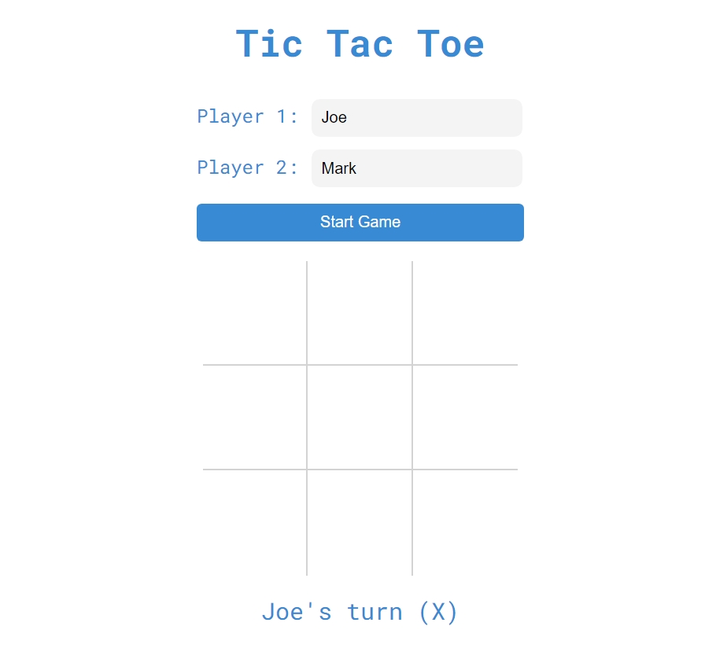

# Tic-Tac-Toe Project

This is a **Tic-Tac-Toe** game built as part of [The Odin Project](https://www.theodinproject.com/) JavaScript curriculum. The project focuses on using JavaScript modules, factory functions, and DOM manipulation to create a functional and interactive game.

## Features

- A fully playable Tic-Tac-Toe game:
- Displays the winner or a tie at the end of the game.
- Dynamic and interactive game board built with DOM manipulation.
- Reset button to restart the game and play again.
- Responsive design for usability on desktop and mobile devices.

## Project Preview



Try the live version of the project here: [Live Preview](https://gonalgar.github.io/tic-tac-toe/)

## Technologies Used

- **HTML5**: Markup for the game board structure.
- **CSS3**: Styling for the layout and game board.
- **JavaScript (ES6)**: Game logic, dynamic board updates, and event handling.

## Getting Started

To view or modify the project locally:

1. Clone this repository:
   ```bash
   git clone https://github.com/gonalgar/tic-tac-toe.git
2. Navigate to the project directory:
    ```bash
    cd library
3. Open the index.html file in your browser to view the library.

## What I Learned
- Using factory functions and modules to organize JavaScript code.
- Implementing game logic and tracking the state of the game.
- Dynamically updating the DOM to reflect user interactions.
- Handling edge cases, such as ties or invalid moves.
- Designing a clean, responsive UI for a better user experience.

## Acknowledgements
This project is part of [The Odin Project Intermediate JavaScript](https://www.theodinproject.com/paths/full-stack-javascript/courses/javascript) curriculum. It provided a great opportunity to practice modular programming and game development techniques.

## License
This project is open-source and available under the MIT License.